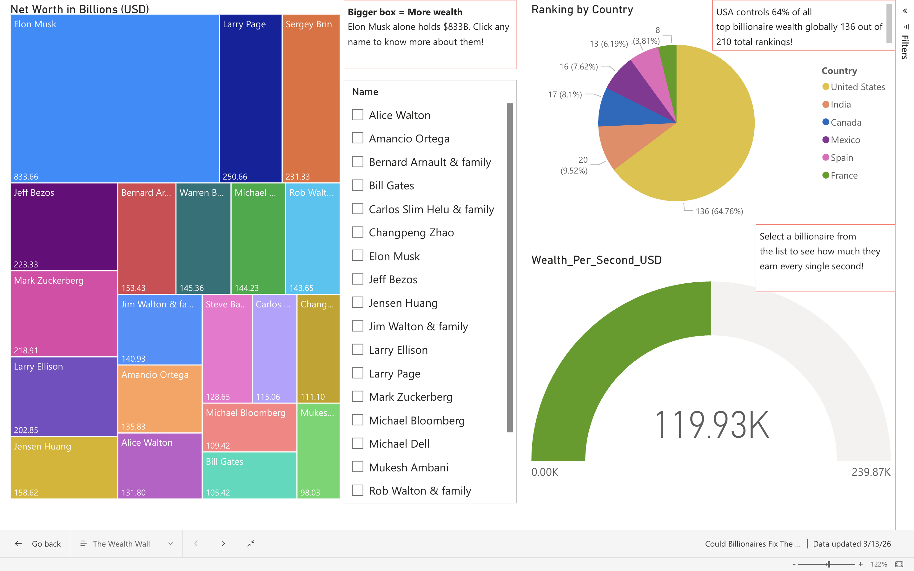
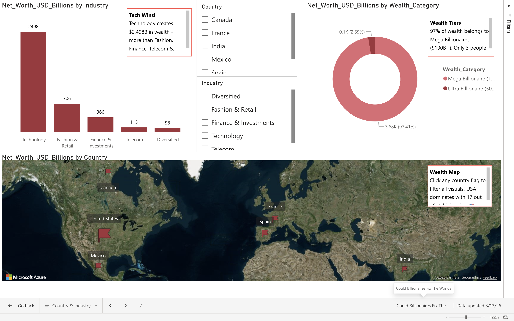
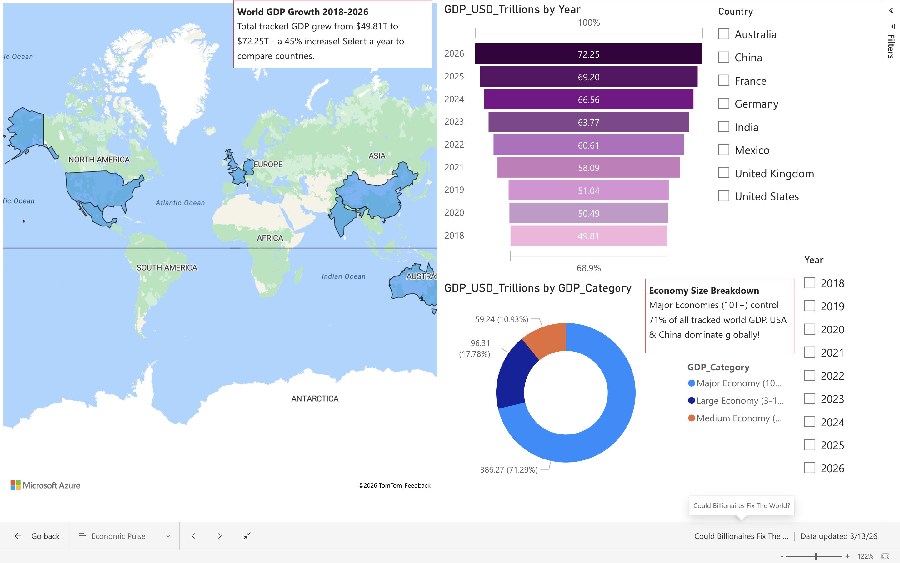
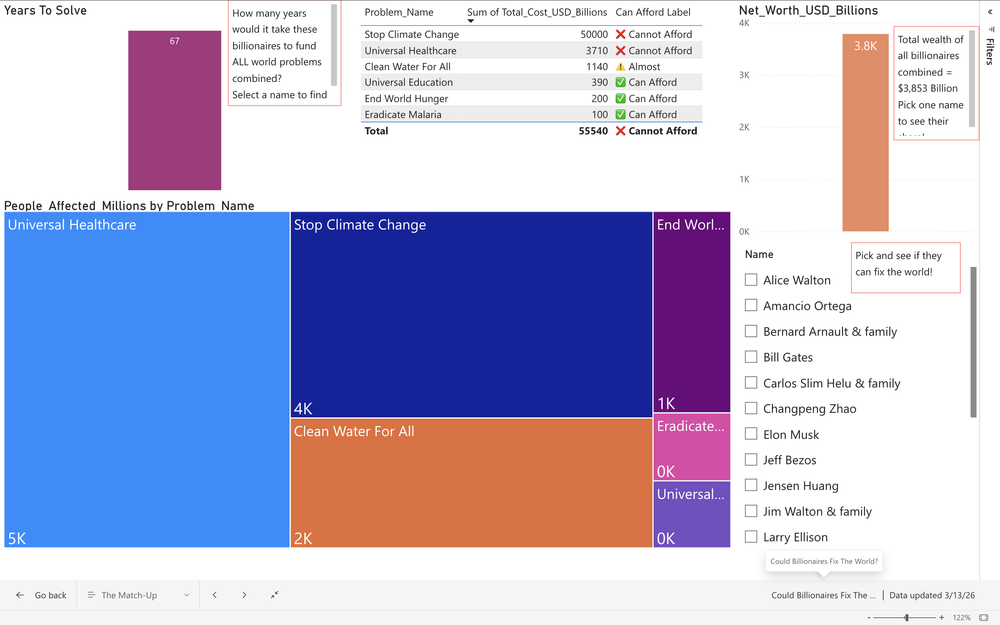
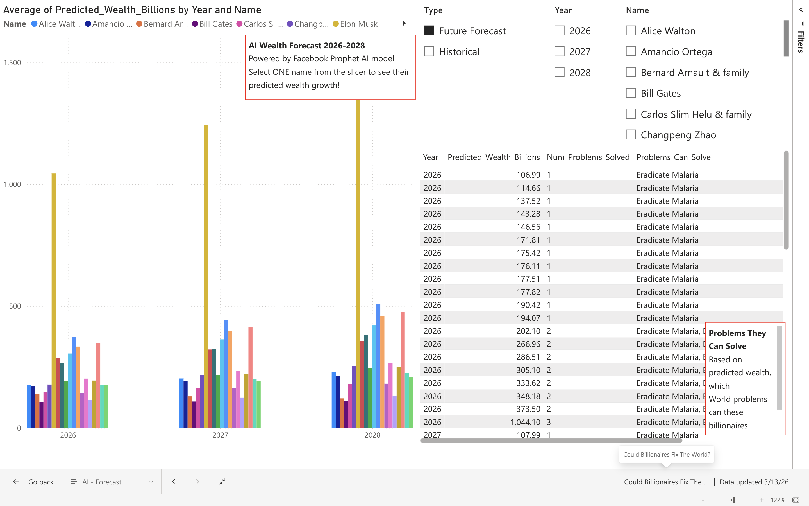

# 💰 Could Billionaires Fix The World?
### An AI-Powered Power BI Dashboard — 2026

## 🎯 Project Overview
An interactive 5-page Power BI dashboard analyzing whether
the world's top 20 billionaires could fund solutions to
humanity's greatest challenges — using live 2026 Forbes
data and Facebook Prophet AI forecasting.

---

## 📊 Dashboard Pages

| Page | Description |
|---|---|
| 💰 The Wealth Wall | Top 20 billionaires 2026 rankings |
| ⚔️ The Match-Up | Billionaire wealth vs world problem costs |
| 📈 Economic Pulse | GDP & economic indicators 2018-2026 |
| 🌍 Country & Industry | Where billionaire wealth comes from |
| 🤖 AI Forecast | Prophet ML predictions 2026-2028 |

---

## 🛠️ Tech Stack

| Tool | Purpose |
|---|---|
| Python 3.12 | Data collection & cleaning |
| Pandas | Data manipulation |
| Facebook Prophet | AI wealth forecasting |
| Power BI Web | Interactive dashboard |
| Forbes API | Live 2026 billionaire data |
| World Bank API | GDP data 2018-2026 |
| FRED API | Economic indicators |

---

## 📁 Project Structure
```
BillionaireDashboard/
├── data/
│   ├── billionaires_final.csv
│   ├── world_problems_final.csv
│   ├── economic_indicators_final.csv
│   ├── gdp_historical.csv
│   ├── date_dimension.csv
│   └── wealth_forecast.csv
├── scripts/
│   ├── get_2026_billionaires.py
│   ├── collect_fred.py
│   ├── get_gdp_historical.py
│   ├── clean_data.py
│   ├── forecast_all.py
│   └── fix_forecast.py
└── README.md
```

---

## 🔑 Key Findings

### 💰 2026 Wealth Rankings
- 🥇 Elon Musk: **$833 Billion**
- 🥈 Larry Page: **$250 Billion**
- 🥉 Sergey Brin: **$231 Billion**
- Combined Top 20: **$3,853 Billion**

### 🌍 World Problems Cost
| Problem | Cost | Affordable? |
|---|---|---|
| Stop Climate Change | $50,000B | ❌ Nobody |
| Universal Healthcare | $3,710B | ❌ Nobody |
| Clean Water For All | $1,140B | ❌ Nobody |
| Universal Education | $390B | ✅ Elon can |
| End World Hunger | $200B | ✅ Top 5 can |
| Eradicate Malaria | $100B | ✅ Top 15 can |

### 🤖 AI Predictions (Prophet Model)
| Name | 2026 | 2027 | 2028 |
|---|---|---|---|
| Elon Musk | $1,044B | $1,243B | $1,443B |
| Larry Page | $373B | $441B | $508B |
| Mark Zuckerberg | $333B | $395B | $458B |
| Jeff Bezos | $286B | $321B | $356B |

---
## 🚀 How to Run

### 1. Clone the repository
```bash
git clone https://github.com/BhavyaPatamsetti/AI_Forecasted_Billionaire_Report_2026.git
cd AI_Forecasted_Billionaire_Report_2026
```

### 2. Install dependencies
```bash
pip install pandas requests prophet numpy
```

### 3. Run data collection
```bash
python scripts/get_2026_billionaires.py
python scripts/collect_fred.py
python scripts/get_gdp_historical.py
```

### 4. Run AI forecast
```bash
python scripts/forecast_all.py
```

---

## 💡 Key Insights

1. **Billionaires COULD solve some problems** but not all
2. **Climate Change** is in a completely different cost category
3. **Wealth inequality is accelerating** — Elon grew from $180B to $833B in 3 years
4. **Technology** is the ultimate wealth creator in the modern economy
5. **If ALL top 20 combined** their wealth they could solve everything EXCEPT Climate Change

---
## 📸 Dashboard Preview

| Page | Screenshot |
|---|---|
| 💰 The Wealth Wall |  |
| 🌍 Country & Industry |  |
| 📈 Economic Pulse |  |
| ⚔️ The Match-Up |  |
| 🤖 AI Forecast |  |

----

## 🎯 The Conclusion
The money EXISTS. The question is — WHERE does it go?


---

## 👩‍💻 Author
**Radhi Sri Bhavya Patamsetti**
- LinkedIn: [https://www.linkedin.com/in/bhavyapatamsetti/]
- GitHub: [https://github.com/BhavyaPatamsetti](https://github.com/BhavyaPatamsetti)

---

## ⭐ If you found this interesting, please star this repo!
